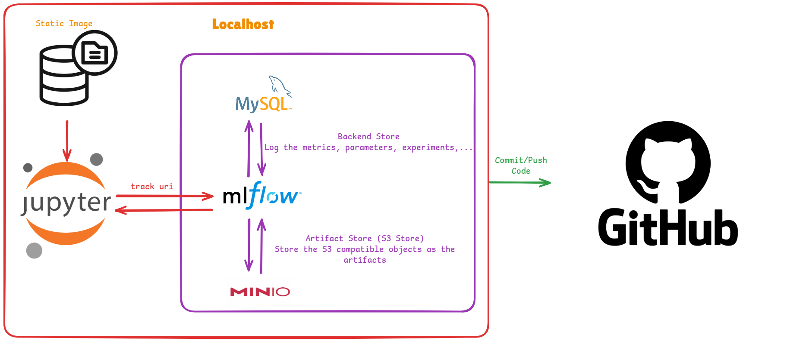
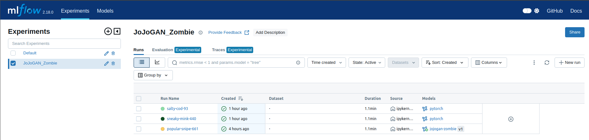
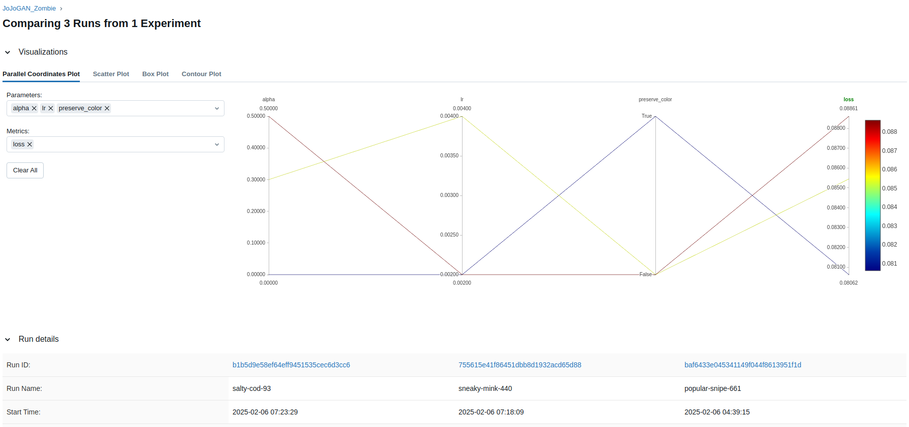
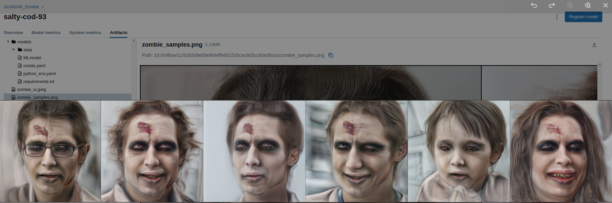
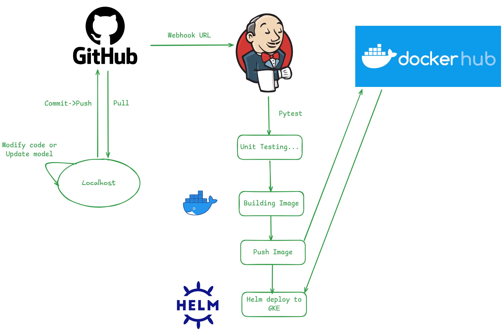

# JoJoGan Zombie

Project guides you to apply One Shot Stylization with JoJoGan

And we will integrate CI/CD to deploy the product on Google Kubernetes Engine (GKE)

## Table of Contents
- [Introduction](#introduction)
- [Features](#features)
- [Installations](#installations)
- 

## Introduction

- Tested on Python 3.9.21, NVIDIA RTX 3060
- We have created [Makefile](Makefile) to help user install the needed configuration (like Ninja package, environment variables for MLFlow,...)
   - Just run `make setup`. It will make your life look easier.
- You could find the training code [here](notebooks/experiments.ipynb)
- We used the following technology:
   - Jupyter Notebook: EDA, Data Transformation and Modelling
   - [uv](https://docs.astral.sh/uv/): An extremely fast Python package and project manager
   - [MLFlow](https://mlflow.org/): open source MLOps Platform log the training results

## Training

- Before training, please notice the following things:
   - Install the virtual environment `.venv` and their dependencies, reccommended by [uv](https://docs.astral.sh/uv/)
   - Create MLFlow, Minio and MySQL Server for logging the training results
   - Install the [Ninja linux package](https://ninja-build.org/)
   - Download [68 Shape Predictor DLIB Model](http://dlib.net/files/shape_predictor_68_face_landmarks.dat.bz2) and extract it to [models](models/) folder
- Watch the following diagram to understand the structure of training process:
   
   
<details>
   <summary>📌 Roles of Components</summary>

   ### 📝 Jupyter Notebook  
  - Interactive environment for developing and experimenting with models.  
  - Supports writing code, visualizing data, and debugging easily.  
  - Integrates well with MLflow for tracking training processes.  

   ### 📊 MLflow  
  - Manages the lifecycle of machine learning models.  
  - Stores and tracks model versions, hyperparameters, and results.  
  - Enables quick deployment of trained models.  

   ### 🗄️ MySQL  
  - Stores MLflow metadata, including training information, metrics, and model details.  
  - Facilitates quick retrieval of data for model comparison.  

   ### ☁️ MinIO  
  - Object storage system (similar to S3) for storing training data and trained models.  
  - Provides fast and secure access to large datasets.  
  - Seamlessly integrates with MLflow for artifact storage.  

</details>

- We have fine-tuned the hyperparameters to find the best `Style2Gan` model
- The training experiments are logged by MLFlow

- You could compare the results (such as loss, metrics, parameters,...) through MLFLow

- MLFlow also log the artifact, which are the S3 objects such as the training model and testing results


## CI/CD Pipeline

In this project, we integrate GitHub and Jenkins to automate the CI/CD process.

- GitHub serves as the version control system, where all source code, configuration files, and model training scripts are stored.
-Jenkins, running inside a Docker container on **Google Compute Engine (GCE)**, is used to automate testing, containerization, and deployment. It is configured to trigger workflows whenever there is a new commit or pull request in the repository.
- Pytest is used for unit and integration testing to ensure code stability.
- Docker is used to package the application, create a Docker image, and push it to Docker Hub.
- Helm is utilized to deploy the application to Google Kubernetes Engine (GKE).



📝 When a change is pushed to the repository (commit, pull request), Jenkins automatically triggers the pipeline
   - Pytest runs automated tests to verify code correctness.
   - If all tests pass, the pipeline proceeds to the build stage.
   - Docker packages the application into a container.
   - The built Docker image is pushed to Docker Hub.
   - Helm is used to deploy the containerized application to Google Kubernetes Engine (GKE).
   - Kubernetes services are updated to ensure the system runs the latest version.
</detail>


## fdsfsd
## Acknowledgements

This project makes use of the following tools and libraries:

- [MLflow On-Premise Deployment using Docker Compose](https://github.com/sachua/mlflow-docker-compose) by Chua Song Ann - A guide to deploy MLFlow On-Premise
- [JoJoGAN: One Shot Face Stylization](https://arxiv.org/abs/2112.11641) by Min Jin Chong, David Forsyth - This paper describes a simple procedure JoJoGAN to learn a style mapper from a single example of the style - [Github Repo](https://github.com/mchong6/JoJoGAN)

We would like to thank the authors of these resources for their valuable contributions.

## Contributing

Thank you for considering contributing to our project! We welcome all kinds of contributions, from bug reports to feature requests and code contributions.

### How to contribute

1. **Fork the repository** - Create a copy of this repository in your GitHub account.
2. **Clone your fork** - Clone the repository to your local machine.
   ```bash
   git clone https://github.com/your-username/your-repo.git
   ```
