# JoJoGan Zombie

Project guides you to apply One Shot Stylization with JoJoGan

And we will integrate CI/CD to deploy the product on Google Kubernetes Engine (GKE)

## Table of Contents
[1. Introduction](#1-introduction)

[2. Training](#2-training)

[3. CI/CD Pipeline](#3-cicd-pipeline)

[4. High level architecture](#4-high-level-architecture)

[5. Results](#5-results)

[Acknowledgements](acknowledgements)

[Contributing](contributing)

## 1. Introduction

- Tested on Python 3.9.21, NVIDIA RTX 3060
- We have created [Makefile](Makefile) to help user install the needed configuration (like Ninja package, environment variables for MLFlow,...)
   - Just run `make setup`. It will make your life look easier.
- You could find the training code [here](notebooks/experiments.ipynb)
- We used the following technology:
<details>
   <summary>🛠 Techs</summary>

   ###
   - Jupyter Notebook: EDA, Data Transformation and Modelling
   - [uv](https://docs.astral.sh/uv/): An extremely fast Python package and project manager
   - [MLFlow](https://mlflow.org/): open source MLOps Platform log the training results
   - [MySQL](https://www.mysql.com/): backend store db for MLFlow
   - [Minio](https://min.io/): S3 Object Storage for artifacts in MLFlow
   - [Helm](https://helm.sh/): helps you manage Kubernetes applications — Helm Charts help you define, install, and upgrade even the most complex Kubernetes application.
   - [Jenkins](https://www.jenkins.io/): Automates CI/CD workflows, enabling continuous integration and deployment of ML models and applications.
   - [Ansible](https://www.redhat.com/en/ansible-collaborative): plays a crucial role in Infrastructure as Code (IaC) within the project by automating the provisioning, configuration, and management of infrastructure components
   - [Google Kubernetes Engine](https://cloud.google.com/kubernetes-engine?hl=en): Manages containerized applications at scale, ensuring high availability and efficient resource utilization
   - [Google Compute Engine](https://cloud.google.com/products/compute?hl=en): Provides virtual machines for hosting various components, including observability and CI/CD tools
   - [FastAPI](https://fastapi.tiangolo.com/): A high-performance web framework for serving ML models and APIs, supporting asynchronous request handling
   - [ELK Stack](https://www.elastic.co/elastic-stack): A centralized logging solution that collects, processes, and visualizes logs from various sources using Elasticsearch, Logstash, and Kibana
   - [Prometheus](https://prometheus.io/): A monitoring and alerting toolkit that scrapes metrics from applications and infrastructure components
   - [cAdvisor](https://github.com/google/cadvisor): Monitors container resource usage and performance, providing insights into CPU, memory, and network usage
   - [Grafana](https://grafana.com/): A visualization tool for creating real-time dashboards from metrics collected by Prometheus and other data sources
   - [Discord](https://discord.com/): Used for real-time notifications and alerts, integrating with monitoring tools to provide incident updates
</details>

## 2. Training

- Before training, please notice the following things:
   - Install the virtual environment `.venv` and [their dependencies](./requirements.txt), recommended by [uv](https://docs.astral.sh/uv/)
   - Just run the `make menu`, choose the options and make sure that:
      - Create MLFlow, Minio and MySQL Server for logging the training results
      - Install the [Ninja linux package](https://ninja-build.org/)
      - Download [68 Shape Predictor DLIB Model](http://dlib.net/files/shape_predictor_68_face_landmarks.dat.bz2) and extract it to [models](models/) folder
- Watch the following diagram to understand the structure of training process:
   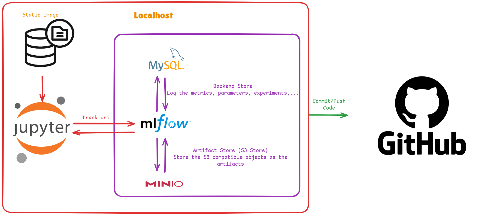
   
<details>
   <summary>📌 Roles of Components</summary>

   ### 📝 Jupyter Notebook  
  - Interactive environment for developing and experimenting with models.  
  - Supports writing code, visualizing data, and debugging easily.  
  - Integrates well with MLflow for tracking training processes.  

   ### 📊 MLflow  
  - Manages the lifecycle of machine learning models.  
  - Stores and tracks model versions, hyperparameters, and results.  
  - Enables quick deployment of trained models.  

   ### 🗄️ MySQL  
  - Stores MLflow metadata, including training information, metrics, and model details.  
  - Facilitates quick retrieval of data for model comparison.  

   ### ☁️ MinIO  
  - Object storage system (similar to S3) for storing training data and trained models.  
  - Provides fast and secure access to large datasets.  
  - Seamlessly integrates with MLflow for artifact storage.  

</details>

- We have fine-tuned the hyperparameters to find the best `Style2Gan` model
- The training experiments are logged by MLFlow
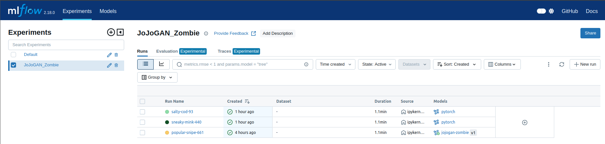
- You could compare the results (such as loss, metrics, parameters,...) through MLFLow
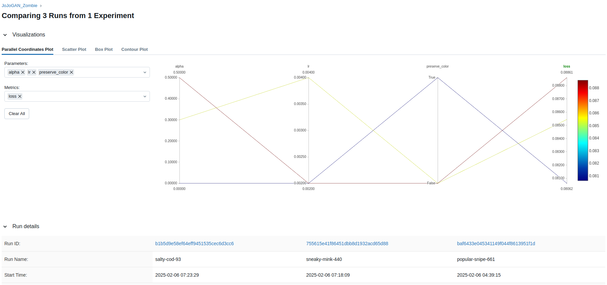
- MLFlow also log the artifact, which are the S3 objects such as the training model and testing results


## 3. CI/CD Pipeline
### 3.1 CI/CD Overview

In this project, we integrate GitHub and Jenkins to automate the CI/CD process.

- GitHub serves as the version control system, where all source code, configuration files, and model training scripts are stored.
-Jenkins, running inside a Docker container on **Google Compute Engine (GCE)**, is used to automate testing, containerization, and deployment. It is configured to trigger workflows whenever there is a new commit or pull request in the repository.
- Pytest is used for unit and integration testing to ensure code stability.
- Docker is used to package the application, create a Docker image, and push it to Docker Hub.
- Helm is utilized to deploy the application to Google Kubernetes Engine (GKE).

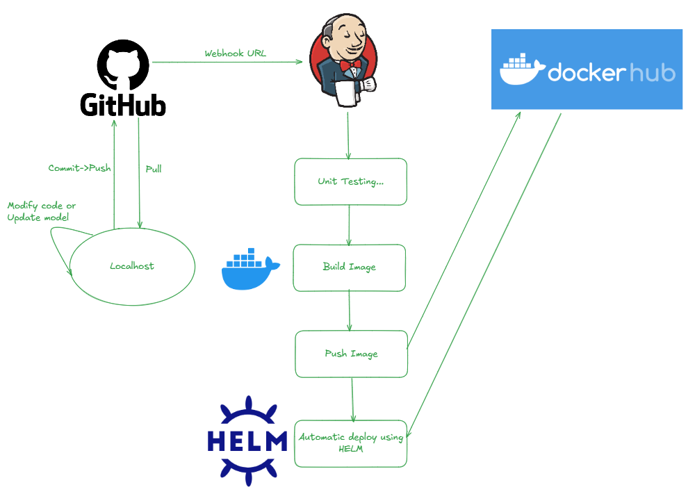

📝 When a change is pushed to the repository (commit, pull request), Jenkins automatically triggers the pipeline
   - Pytest runs automated tests to verify code correctness.
   - If all tests pass, the pipeline proceeds to the build stage.
   - Docker packages the application into a container.
   - The built Docker image is pushed to Docker Hub.
   - Helm is used to deploy the containerized application to Google Kubernetes Engine (GKE).
   - Kubernetes services are updated to ensure the system runs the latest version.
</detail>

### 3.2 How to Guide

To successfully create a Google Compute Engine (GCE) instance, ensure the following prerequisites:
- Make sure you have already installed the [gcloud CLI](https://cloud.google.com/sdk/docs/install#deb)
- Initialize the gcloud CLI
```
gcloud init
```
- Pick your cloud project
- Create your service account, and select `Edit` role (Full management of GCE and GKE) for your service account
- Create a new key as json type for your service account. Download this json file.
- The service account key file (with a .json extension) is stored in the directory: `/ansible/secrets/`
- Follow these steps:
```
cd ./infra/ansible/deploy_jenkins
ansible-playbook create_compute_instance.yaml
```
- Wait for the compute engine running. After that, you need to create the SSH connection from localhost to it. And copy the External IP to the file [inventory](./ansible/inventory)
- Run the following code to install Docker and Jenkins on the compute engine:
```
ansible-playbook deploy_jenkins.yaml -i ../inventory
```
- After Jenkins run successfully, you need to go to the Jenkins browser. In my case, it would be `<EXTERNAL IP>:8081`.
- You need to install the required plugins, such as Docker and Kubernetes. Moreover, you need to create the Github and Docker credential in Jenkins.
- Create a pipeline with Github, and add a webhook on it.

## 4. High-level architecture

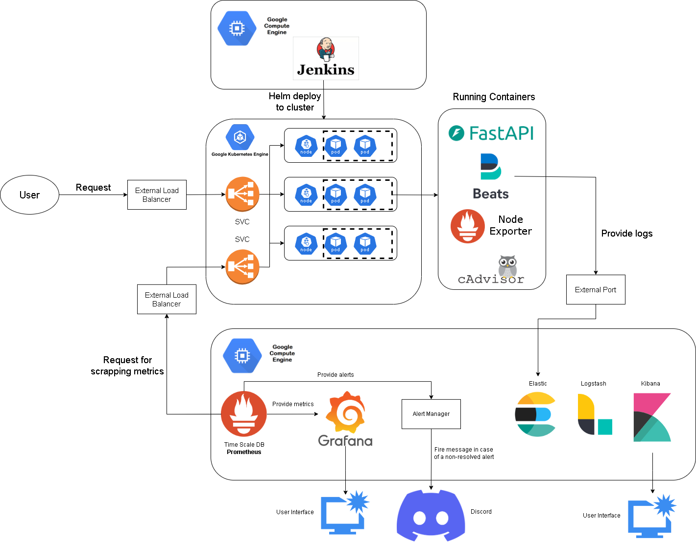

When deploying the application to the cluster using Helm, the following components are set up:

### 4.1. Deployment Overview
#### 4.1.1 Application Deployment:
- The application is deployed with **3 replicas**.
- **1 external ports** is exposed for user requests 
- **3 external ports** are exposed for Prometheus to scrape metrics.
#### 4.1.2 Metrics Collection:
- Node Exporter is deployed to collect system metrics, with the required ports exposed.
- cAdvisor is deployed to collect container-level metrics, with the required ports exposed.
- Application metrics are exposed via dedicated ports for Prometheus to scrape.
#### 4.1.3 Log Forwarding:
- Filebeat is deployed to collect and forward logs to Elasticsearch.
This setup ensures that the application is accessible, system and container metrics are collected, and logs are properly forwarded for monitoring and analysis.
### 4.2. Deployment Guide
#### 4.2.1 Create Google Kubernetes Engine
- Go to the folder `./infra/ansible`, you need to run the following code:
```
ansible-playbook create_gke.yaml
```
- Wait for the GKE runs successfully, you need to connect it in the localhost
```
gcloud container clusters get-credentials <CLUSTER_NAME> --region <REGION>
```
- After that, just run the `make menu`, and choose **8**. It will create necessary namespaces (like model-serving, kube-metrics) and grant permissions to the default user
- You also need to create a `cloud instance` in Jenkins browser. Copy the **server url** and the **certificate-authority-data** of the GKE to the form for creating cloud in Jenkins
- You need to validate it has already connected to the GKE cluster or not. In the Jenkins file, we have already add the following code to deploy app in GKE
```
helm upgrade --install jojogan-zombie ./helm/jojogan-zombie --namespace model-serving
```
- After connecting to GKE, you also need to deploy the Node Exporter and CAdvisor to GKE, just run `make menu` and choose **9**
- You need to make sure you already have following variables in `./bin/.env` before deploying filebeat to GKE:
```
ELASTIC_USERNAME=""
ELASTIC_PASSWORD=""
ELASTIC_HOST=""
ELASTIC_PORT=""
```
- You can deploy filebeat to GKE by running `make menu` and choosing **7**

### 4.3. Observability Overview
To ensure comprehensive monitoring and logging, a second Google Compute Engine (GCE) instance is used to run the following observability components:

#### 4.3.1 Prometheus – Collects and stores time-series metrics from the application, system, and container-level exporters. It enables real-time monitoring and alerting based on predefined rules.

#### 4.3.2 Grafana – Provides a visual dashboard for analyzing metrics collected by Prometheus. It allows interactive exploration and visualization of system health and performance trends.

#### 4.3.3 Alert Manager – Handles alerts generated by Prometheus. It groups, deduplicates, and routes alerts to various notification channels. In this project, we use Discord

#### 4.3.4 ELK Stack (Elasticsearch, Logstash, Kibana) –

- Elasticsearch stores and indexes logs for efficient searching and analysis.
- Logstash processes and transforms log data before storing it in Elasticsearch.
- Kibana provides visualization and querying capabilities for log analysis.

### 4.4. Observability Guide

- Go to the folder `./infra/ansible/deploy_elk`, you need to run the following code:
```
ansible-playbook create_gce_elk.yaml
```
- Wait for the compute engine running. After that, you need to create the SSH connection from localhost to it. And copy the External IP to the file [inventory](./infra/ansible/inventory)
- Run the following code to install Docker and Jenkins on the compute engine:
```
ansible-playbook install_docker.yaml -i ../inventory
```
- After that, you need to copy the `elk-docker-compose` and `prom-graf-docker-compose` folders to the second compute engine. Just run `make menu` and choose **6**
- You need to type the `<EXTERNAL_IP>` of the compute engine in the CLI and enter it
- Create a ssh connection in the CLI to the compute engine
- Go to folder `elk-docker-compose` and run `docker compose -f elk-docker-compose.yml up -d`
- Before starting prometheus, you need to make sure the correct following things:
   - The [alert rules](./prom-graf-docker-compose/prometheus/config/alert-rules.yml)
   - The [correct URL for scrapping metrics](./prom-graf-docker-compose/prometheus/config/prometheus.yml)
- Go to folder `prom-graf-docker-compose` and run `docker compose -f prom-graf-docker-compose.yaml up -d`

This setup ensures end-to-end observability by enabling real-time monitoring, alerting, and log analysis, helping to detect and troubleshoot issues efficiently.

## 5. Results

- Go to the `<EXTERNAL IP>:8000`. The `<EXTERNAL IP>` is the IP of load balancer for app in GKE:
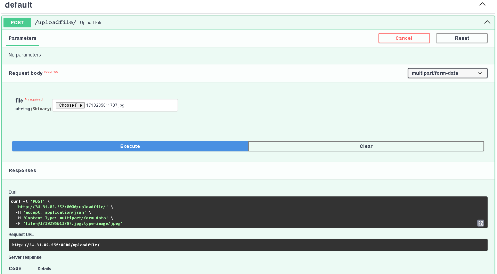 
- Try making user request, you will receive images like this:

- Go to the `<EXTERNAL IP ELK PROM GRAF>:5601`. The `<EXTERNAL IP ELK PROM GRAF>` here is the IP of the second computer engine and 5601 is the exposed port for Kibana:
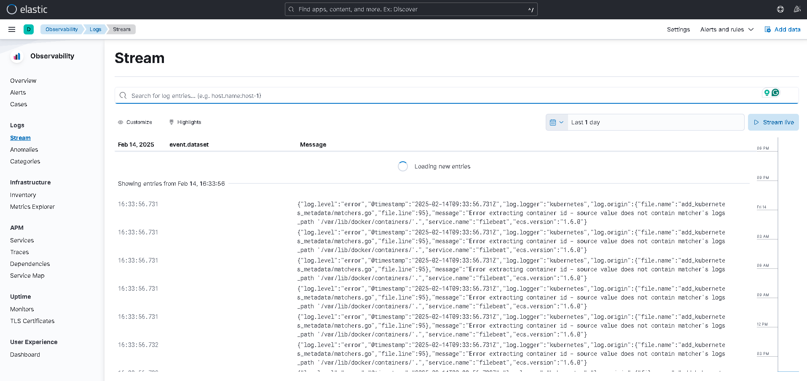
- Go to the `<EXTERNAL IP ELK PROM GRAF:9090>`. 9090 is the exposed port for prometheus. You can query the necessary metrics like the RPS in the latest 1 hour
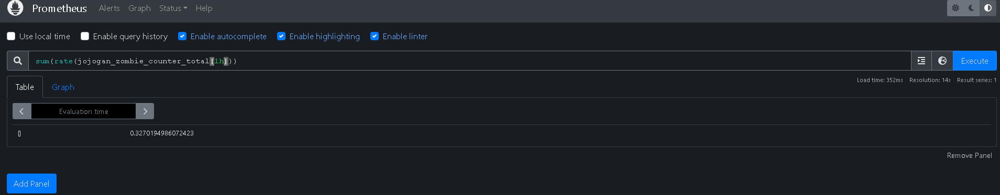
- Go to the `<EXTERNAL IP ELK PROM GRAF:3000>`. 3000 is the exposed port for grafana. You can create, edit, query, and do everything about dashboard and metrics. The system metrics will be displayed like following picture:
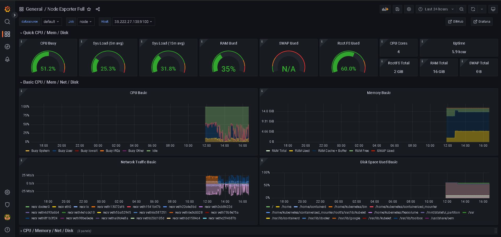
- You can also create dashboard about the custom metrics
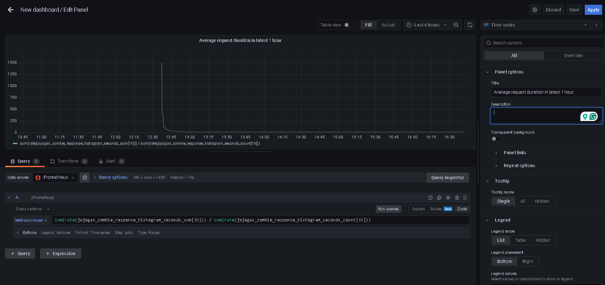
- Finally, when there is an alert, we will notice by the event triggered in prometheus
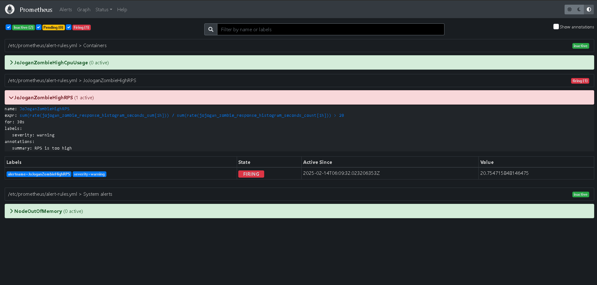
- It will fire a message in discord channel
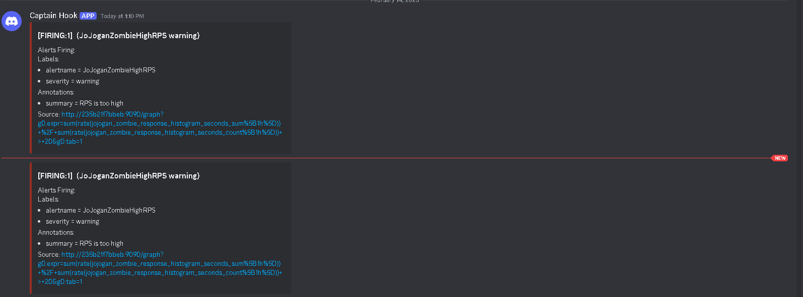

## Acknowledgements

This project makes use of the following tools and libraries:

- [MLflow On-Premise Deployment using Docker Compose](https://github.com/sachua/mlflow-docker-compose) by Chua Song Ann - A guide to deploy MLFlow On-Premise
- [JoJoGAN: One Shot Face Stylization](https://arxiv.org/abs/2112.11641) by Min Jin Chong, David Forsyth - This paper describes a simple procedure JoJoGAN to learn a style mapper from a single example of the style - [Github Repo](https://github.com/mchong6/JoJoGAN)

We would like to thank the authors of these resources for their valuable contributions.

## Contributing

Thank you for considering contributing to our project! We welcome all kinds of contributions, from bug reports to feature requests and code contributions.

### How to contribute

1. **Fork the repository** - Create a copy of this repository in your GitHub account.
2. **Clone your fork** - Clone the repository to your local machine.
```
git clone https://github.com/your-username/your-repo.git
```
